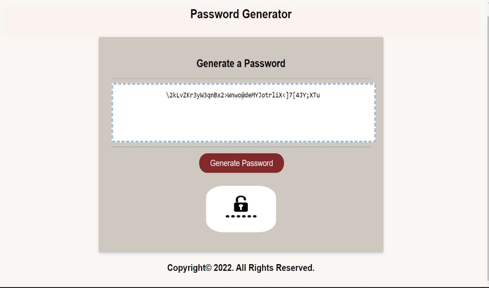

## Password Generator ##

Table of contents:

1. About the proyect
2. Installation
3. Usage
4. Credits
5. License

# About the project #

The main purpose of this project is to generate a secure password for the user purposes, it helps to have a high security password and it is easy to make it by choosing what type of characters the user wants and the length as he/she requires. This application saves time for the user to think and create one by his/her own, and using this application helps to have a desired high secure password.

# Installation #

N/A

# Usage #

This app can be used by anyone who wants to create a secure password, having the possibility to select one or more types of characters defined in the criteria as special characters, numeric characters, lower cased characters, and upper cased characters. 
The users selects the length and the type of characters desired, the user has to click on the button "Generate Password" in order to start the process of creating a password that will be displayed in the box of "Your Secure Password" once the criteria is met with a minimum of 10 characters and a maximum of 100 characters.

The following image shows the web application's appearance and functionality:

- link to deployed application: [Password Generator](https://naidiri1.github.io/password-generator/)

# Credits #

N/A

# License #
N/A

